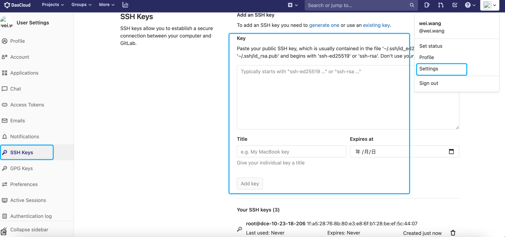
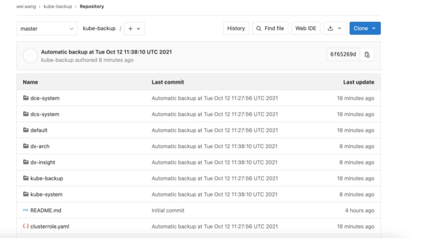

kube-backup
===========
Kubernetes 资源备份工具，旨在作为 kubernetes Job 运行。

## 离线部署

### 离线包说明
离线包构建地址：http://jenkins.ats.io:8080/
Job：dce-backup-yaml-amd64
当前最新版离线包：

### 离线部署步骤

下载离线包(请替换最新版离线包)：
wget https://qiniu-download-public.daocloud.io/etc-solution/kube-backup_v1_ww_0e110bfd071229d14e6ad72b86fb607900915d93.tar.gz
进入部署目录：
···
cd deploy
···
配置变量：
```shell
# 参考示例

#!/bin/bash

# -------- 必选参数 -------
# 这里需要设置内部仓库的地址和租户,并且请设置租户为公开
REGISTRY='10.23.101.11/daocloud'
# 这里需要设置内部仓库的用户和密码, 推送镜像用,
REGISTRY_USER="admin"
REGISTRY_PASSWORD="changeme"

# 镜像架构
ARCH=`arch`
if [[ "$ARCH" == "aarch64" ]]; then
   MANIFEST="arm64"
elif [[ "$ARCH" == "x86_64" ||  "$ARCH" == "i386" ]]; then
    MANIFEST="amd64"
fi

## 如果部署混合集群，需要配置以下参数
# 指定amd镜像包
amdpackage=images-amd64.tar
# 指定arm镜像包
armpackage=images-arm64.tar

#
export REGISTRY='10.23.101.11/daocloud'
export KUBEBACKUP_CLEAN_IMAGENAME=hyperkube:v1.5.4
export KUBEBACKUP_IMAGENAME=kube-backup:v1.17.1
export KUBEBACKUP_GIT_REPO="git@gitlab.daocloud.cn:etc-common/dce-cluster-backup.git"
# 需要备份的资源类型；默认备份全部api-resource；如果需要指定类型，请在此处配置。
export KUBEBACKUP_RESOURCETYPES=""
export KUBEBACKUP_GIT_PREFIX_PATH=/10-23-101-10
export KUBEBACKUP_GIT_BRANCH=main
```

一键部署：

为 Gitlab 备份仓库账号添加 SSHKey：


检查部署效果：
```
kubectl -n kube-backup get cj
NAME                        SCHEDULE       SUSPEND   ACTIVE   LAST SCHEDULE   AGE
kube-state-backup           */10 * * * *   False     6        3m2s            65m
kube-state-backup-cleaner   1 6 * * *      False     0        <none>          65m
```

```
kubectl -n kube-backup get pods
NAME                                 READY   STATUS             RESTARTS   AGE
kube-state-backup-1656665400-6ptrj   0/1     Completed          0          21m
kube-state-backup-1656666000-w29kz   1/1     Running            0          11m
```



## 常规部署

### 准备工作

```shell
# 下载源码
git clone https://gitlab.daocloud.cn/ats/etc/dce-backup.git
# 注意：请确保master分支存在
cd kube-backup

# 创建一个namespace
kubectl create ns kube-backup

#创建SSH证书(尽量避免与主机/${HOME}/.ssh/ 上的key冲突，如果已有，可以只执行ssh-keyscan，create secret也要在此目录)
ssh-keygen -f ./id_rsa
#如果使用已有私钥，可命名为id_rsa，并使用-f指定
ssh-keyscan -f ./id_rsa  $YOUR_GIT_URL > known_hosts
#例如：ssh-keyscan gitlab.daocloud.cn -f ./id_rsa > known_hosts

#将SSH证书加入secret内，供CronJob与Gitlab互联使用
kubectl create secret generic kube-backup-ssh -n kube-backup --from-file=id_rsa --from-file=known_hosts
```


### 身份验证

根据实际情况选择身份验证机制，此处为SSH认证，如果需要其他认证可参考后面的高级配置。

创建备份保存的GIT仓库，且备份用户最好具有较高读写权限。比如创建的备份仓库地址：`git@gitlab.daocloud.cn:wei.wang/kube-backup.git`


将`id_rsa.pub` 证书内容加到GIT 用户 SSH Keys中


### 部署CronJob

修改 cronjob-ssh.yaml 中GIT_REPO地址为`git@gitlab.daocloud.cn:wei.wang/kube-backup.git`
如果需要指定仓库下目录以区分不同集群可指定环境变量 `GIT_PREFIX_PATH`
如果需要指定分支请配置`GIT_BRANCH`

根据需求修改cronjob 定时备份频率，默认10分钟。

```shell
# 应用这个目录下的3个yaml
kubectl apply -f rbac.yaml,cronjob-ssh.yaml,job-cleanup.yaml

# 查看效果
$ kubectl get cronjobs -n kube-backup
NAME                SCHEDULE       SUSPEND   ACTIVE   LAST SCHEDULE   AGE
kube-state-backup   */10 * * * *   False     0        <none>          27s
kube-state-backup-cleaner  1 6 * * *   False   0       <none>         77s

# 默认是10分钟执行一次，可以根据自己的需求改
```


### 备份效果


高级配置
-----
使用部署示例（[ssh](https://github.com/53537/kube-backup/blob/master/cronjob-ssh.yaml)或[AWS CodeCommit](https://github.com/53537/kube-backup/blob/master/cronjob-codecommit.yaml)身份验证）并`CronJob`在您的 kubernetes（1.5 及更高版本）集群中部署 ，确保将 kubernetes 资源定义备份到您的私有 git 存储库。

定义以下环境变量：

  * `GIT_REPO` - GIT仓库URL. **必要**
  * `GIT_PREFIX_PATH` - GIT仓库中子目录的路径. **默认**: `.`
  * `NAMESPACES` - 需要备份的命名空间列表. **默认**: `all`
  * `GLOBALRESOURCES` - 需要备份的全局资源类型列表. **默认**: `namespace`
  * `RESOURCETYPES` - 需要备份的资源类型列表. **默认**: `ingress deployment configmap svc rc ds networkpolicy statefulset storageclass cronjob`. **注意** `Secret` 默认情况下不备份 ( [git-crypt section](#git-crypt) for details).
  * `GIT_USERNAME` - GIT用户的显示名称. **默认**: `kube-backup`
  * `GIT_EMAIL` - GIT用户的电子邮件地址. **默认**: `kube-backup@example.com`
  * `GIT_BRANCH` - 使用特定的GIT分支 . **默认**: `master`
  * `GITCRYPT_ENABLE` - 使用 git-crypt 进行数据加密。有关详细信息，请参阅[git-crypt 部分](https://github.com/53537/kube-backup#git-crypt). **默认**: `false`
  * `GITCRYPT_PRIVATE_KEY` - git-crypt 的私有 gpg 密钥的路径。有关详细信息，请参阅[git-crypt 部分](https://github.com/53537/kube-backup#git-crypt)。**默认**：`/secrets/gpg-private.key`
  * `GITCRYPT_SYMMETRIC_KEY` -  git-crypt 共享对称密钥的路径。请参阅[git-crypt 部分](https://github.com/53537/kube-backup#git-crypt)。**默认**：`/secrets/symmetric.key`


选择两种身份验证机制之一:

  * 在使用 AWS CodeCommit 和来自 AWS 的基于策略的访问时，修改您的集群配置以提供对该 CodeCommit 存储库的 GitPull 和 GitPush 访问到您的集群。如果使用`kops`，配置将如下所示:

  ```yaml
    additionalPolicies:
      node: |
        [
          {
            "Effect": "Allow",
            "Action": [
              "codecommit:GitPull",
              "codecommit:GitPush"
            ],
            "Resource": "arn:aws:codecommit:<region>:<account name>:<repo-name>"
          }
        ]
  ```


  * 使用不同的存储库（GitHub、BitBucket 等）时，`/backup/.ssh`使用以下文件挂载已配置的 ssh 目录:

    * `known_hosts` - 预装了主机的 SSH 主机密钥`$GIT_REPO`.
    * `id_rsa` -  用户的 SSH 私钥允许推送到`$GIT_REPO`.

  创建SSH证书:
  ```bash
  ssh-keygen -f ./id_rsa
  ssh-keyscan $YOUR_GIT_URL > known_hosts

  kubectl create secret generic kube-backup-ssh -n kube-backup --from-file=id_rsa --from-file=known_hosts
  ```

  注意：如果`id_rsa`未在您的 ssh 目录中找到，备份工具将默认使用的是 AWS CodeCommit。

可选配置项：

- `spec.schedule`使用[cron 格式](https://en.wikipedia.org/wiki/Cron)修改备份频率,**默认**:`10min`。
- 修改成功和失败完成作业的数量以保留在`spec.successfulJobsHistoryLimit`和 中`spec.failedJobsHistoryLimit`。
- 如果使用 RBAC (1.6+)，请使用 rbac.yaml 中的 ClusterRole 和 ClusterRoleBindings。

git-crypt
---------
出于安全原因，默认情况下`Secret`不作备份。但是，可以使用[git-crypt 项目](https://github.com/AGWA/git-crypt)安全地存储它们。

#### 先决条件
您的存储库必须已经使用 git-crypt 初始化。下面列出了最低配置。有关详细信息和完整信息，请参阅[使用 git-crypt](https://github.com/AGWA/git-crypt#using-git-crypt)。

```
cd repo
git-crypt init
cat <<EOF > .gitattributes
*.secret.yaml filter=git-crypt diff=git-crypt
.gitattributes !filter !diff
EOF
git-crypt add-gpg-user <USER_ID>
git add -A
git commit -a -m "initialize git-crypt"
```

可选配置:
  * 您可以选择任何子目录来存储 .gitattributes 文件（使用时很有用`GIT_PREFIX_PATH`）。
* 您可以加密除 secret.yaml 之外的其他文件。在 .gitattribute 过滤器之前添加额外的行。您还可以使用通配符`*`来加密目录中的所有文件。

#### 启用 git-crypt
启用加密功能:
  * 将 CronJob 环境变量设置`GITCRYPT_ENABLE`为`true`
    ```
    spec:
      containers:
      - env:
        - name: GITCRYPT_ENABLE
          value: "true"
    ```
  * 创建附加的`Secret`包含对象**或者**GPG-私人或对称密钥
    ```
    apiVersion: v1
    kind: Secret
    metadata:
      name: kube-backup-gpg
      namespace: kube-system
    data:
      gpg-private.key: <base64_encoded_key>
      symmetric.key: <base64_encoded_key>
    ```
  * 从`Secret`附加卷安装密钥
    ```
    spec:
      containers:
      - volumeMounts:
        - mountPath: /secrets
          name: gpgkey
      volumes:
      - name: gpgkey
        secret:
          defaultMode: 420
          secretName: kube-backup-gpg
    ```
  * 将秘密对象名称添加到`RESOURCETYPES`变量
    ```
    spec:
      containers:
      - env:
        - name: RESOURCETYPES
          value: "ingress deployment configmap secret svc rc ds thirdpartyresource networkpolicy statefulset storageclass cronjob"
    ```
  * 如果使用 RBAC (1.6+)，添加`secrets`到`resources`
    ```
    rules:
    - apiGroups: ["*"]
      resources: [
        "configmaps",
        "secrets",
    ```

  * **注意**:`$GITCRYPT_PRIVATE_KEY`和`$GITCRYPT_SYMMETRIC_KEY`变量`Secret`是安装卷的路径和来自该对象的项键名称的组合。如果您从上面的示例中更改了它们的任何值，您可能需要相应地设置此变量。


备份结果
------
所有配置的资源将按照`$namespace/$name.$type.yaml`文件结构导出到 YAML 格式的目录树结构中.

```
.
├── kube-system
│   ├── attachdetach-controller.serviceaccounts.yaml
│   ├── canal-config.configmap.yaml
│   ├── canal.daemonset.yaml
│   ├── canal.serviceaccounts.yaml
│   ├── certificate-controller.serviceaccounts.yaml
│   ├── cronjob-controller.serviceaccounts.yaml
│   ├── daemon-set-controller.serviceaccounts.yaml
│   ├── default.serviceaccounts.yaml
│   ├── deployment-controller.serviceaccounts.yaml
│   ├── disruption-controller.serviceaccounts.yaml
│   ├── dns-controller.deployment.yaml
│   ├── dns-controller.serviceaccounts.yaml
│   ├── endpoint-controller.serviceaccounts.yaml
│   ├── generic-garbage-collector.serviceaccounts.yaml
│   ├── horizontal-pod-autoscaler.serviceaccounts.yaml
│   ├── job-controller.serviceaccounts.yaml
│   ├── kube-backup-gpg.secret.yaml
│   ├── kube-backup.serviceaccounts.yaml
│   ├── kube-backup-ssh.secret.yaml
│   ├── kube-dns-autoscaler.configmap.yaml
│   ├── kube-dns-autoscaler.deployment.yaml
│   ├── kube-dns-autoscaler.serviceaccounts.yaml
│   ├── kube-dns.deployment.yaml
│   ├── kube-dns.serviceaccounts.yaml
│   ├── kube-dns.service.yaml
│   ├── kubelet.service.yaml
│   ├── kube-prometheus-exporter-kube-controller-manager.service.yaml
│   ├── kube-prometheus-exporter-kube-dns.service.yaml
│   ├── kube-prometheus-exporter-kube-etcd.service.yaml
│   ├── kube-prometheus-exporter-kube-scheduler.service.yaml
│   ├── kube-proxy.serviceaccounts.yaml
│   ├── kube-state-backup-new.cronjob.yaml
│   ├── kube-sysctl.daemonset.yaml
│   ├── letsencrypt-prod.secret.yaml
│   ├── namespace-controller.serviceaccounts.yaml
│   ├── node-controller.serviceaccounts.yaml
│   ├── openvpn-ccd.configmap.yaml
│   ├── openvpn-crl.configmap.yaml
│   ├── openvpn.deployment.yaml
│   ├── openvpn-ingress.service.yaml
│   ├── openvpn-pki.secret.yaml
│   ├── openvpn-portmapping.configmap.yaml
│   ├── openvpn-settings.configmap.yaml
│   ├── persistent-volume-binder.serviceaccounts.yaml
│   ├── pod-garbage-collector.serviceaccounts.yaml
│   ├── replicaset-controller.serviceaccounts.yaml
│   ├── replication-controller.serviceaccounts.yaml
│   ├── resourcequota-controller.serviceaccounts.yaml
│   ├── route53-config.secret.yaml
│   ├── service-account-controller.serviceaccounts.yaml
│   ├── service-controller.serviceaccounts.yaml
│   ├── statefulset-controller.serviceaccounts.yaml
│   ├── sysctl-options.configmap.yaml
│   ├── tiller-deploy.deployment.yaml
│   ├── tiller-deploy.service.yaml
│   ├── tiller.serviceaccounts.yaml
│   └── ttl-controller.serviceaccounts.yaml
├── prd
│   ├── initdb.configmap.yaml
│   ├── example-app.deployment.yaml
│   ├── example-app.ingress.yaml
│   ├── example-app.secret.yaml
│   ├── example-app.service.yaml
│   ├── postgres-admin.secret.yaml
│   ├── postgresql.deployment.yaml
│   ├── postgresql.service.yaml
│   ├── postgres.secret.yaml
│   ├── prd.example.com.secret.yaml
│   ├── redis.service.yaml
│   └── redis-standalone.rc.yaml
└── staging
    ├── initdb.configmap.yaml
    ├── example-app.deployment.yaml
    ├── example-app.ingress.yaml
    ├── example-app.secret.yaml
    ├── example-app.service.yaml
    ├── postgres-admin.secret.yaml
    ├── postgresql.deployment.yaml
    ├── postgresql.service.yaml
    ├── postgres.secret.yaml
    ├── staging.example.com.secret.yaml
    ├── redis.service.yaml
    └── redis-standalone.rc.yaml

3 directories, 80 files
```

